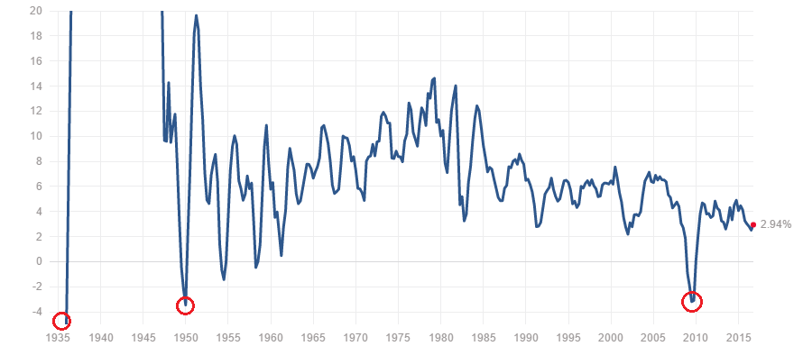

## Step1: Pattern of US GDP Growth Plot
Here i'm interested in the relationship between US GDP growth and inauguration speech.\newline\
I figured out there were some speeches carried out when US GDP reached a very low point (Local minimum point on the US GDP Growth Rate Plot).I circled it out on the graph.


```{r, message=FALSE, warning=FALSE,echo = FALSE}

library(tm)
library(wordcloud)
library(RColorBrewer)
library(dplyr)
library(tidytext)
library("rvest")
library("tibble")
library("qdap")
library("sentimentr")
library("gplots")
library("syuzhet")
library("factoextra")
library("beeswarm")
library("scales")
library("RANN")
library("topicmodels")


source("C:/Users/Simon/Desktop/Zhuhe/Spr2017-Proj1-zhuuu-master/lib/plotstacked.R")
source("C:/Users/Simon/Desktop/Zhuhe/Spr2017-Proj1-zhuuu-master/lib/speechFuncs.R")
```


```{r,echo = FALSE}
#folder.path="../data/inaugurals/"

folder.path="C:/Users/Simon/Desktop/Zhuhe/Spr2017-Proj1-zhuuu-master/data/InauguralSpeeches/"

speeches=list.files(path = folder.path, pattern = "*.txt")
prex.out=substr(speeches, 6, nchar(speeches)-4)

ff.all<-Corpus(DirSource(folder.path))
```


```{r,echo = FALSE}
ff.all<-tm_map(ff.all, stripWhitespace)
ff.all<-tm_map(ff.all, content_transformer(tolower))
ff.all<-tm_map(ff.all, removeWords, stopwords("english"))
ff.all<-tm_map(ff.all, removeWords, character(0))
ff.all<-tm_map(ff.all, removePunctuation)

tdm.all<-TermDocumentMatrix(ff.all)

tdm.tidy=tidy(tdm.all)

tdm.overall=summarise(group_by(tdm.tidy, term), sum(count))
```

```{r,echo = FALSE}
dtm <- DocumentTermMatrix(ff.all,
                          control = list(weighting = function(x)
                                             weightTfIdf(x, 
                                                         normalize =FALSE),
                                         stopwords = TRUE))
ff.dtm=tidy(dtm)
```

 

####US GDP Growth Rate

**Mean:**	8.29% \newline\
**Median:**	6.41% \newline\
**Min:**	-45.32%	(Dec 1933) \newline\
**Max:**	118.27%	(Dec 1944) \newline\
Source From: <http://www.multpl.com/us-gdp-growth-rate>
\newline\
\newline\
\newline\

We have following three presidents giving inauguration speech when GDP reached the local minimum.


\newline\
*Note: There are some other local minimum points on the GDP plot such as Year 1955. However president Eisenhower did not gave the speech this year, so I would not analysis his speech. *


## Step2: Word Cloud Analysis 

US GDP Growth Rate reached it's minimum at 1933 (-45.32%) at the above graph.It is due to the Great Depression (1929--1933) \newline\
By looking at the US Presidents list, we found that Herbert Hoover was elected on 1929 --- the year when Great Depression began. How does his inauguration speech related with the Great Depression? Let's see what's the most frequent words he used in the speech (Use Word Cloud).\newline\
\newline\
Herbert Hoover used **enforcement** and **18th** mostly he also mentioned **ideals**, **criminals**, **federal** and **liquor** which seems irrelevant to Great Depression. Let's look at the timeline precisely in year 1929, Herbert Hoover was elect on March 4, 1929 however the Great Depression happened on Oct 24, 1929 , which is after Hoover's speech. That's why we couldn't find any Great Depression- related words.

\newline\
By 1933, Franklin D. Roosevelt was elected and we can see GDP increased tremendously. Let's see what words he used in the inauguration speech.Roosevelt used words such as **helped**, **stricken** , **emergency**, **critical** which shows how badly he wanted to bring the economic back. We can tell how success Roosevelt's policy was based on the GDP growth rate plot.

\newline\
By 1949, during the cold war, Truman was elected. He used the words such as **program**, **technical**,**scientific** and **recovery** and we can guess his strategy is to stimulate the economic by improving science and technology. During his presidency ,the major corporations in America grew fastly. \newline\
By 1950, new conglomerates (firms with holdings in a variety of industries) led the way. International Telephone and Telegraph,for example, bought Sheraton Hotels, Continental Baking, Hartford Fire Insurance, and Avis Rent-a-Car, among other companies. 
The rise in defense spending as the Cold War escalated also played a part.\newline\


The GDP Growth Rate plot reached to another local around 2008 due to global financial crisis. \newline\
Let's see what Obama (2009-2017) said in his inauguration speech.
Obama used words such as **Jobs** , **crisis**, **workers** shows the speech is highly correlated with the global financial crisis. \newline\
```{r, warning=FALSE,echo = FALSE}

speeches1<- speeches[c(5,12,24,25)]


library(shiny)

shinyApp(
  
fluidPage(
  # Application title
  titlePanel("Word Cloud"),

  sidebarLayout(
    # Sidebar with a slider and selection inputs
    sidebarPanel(
       selectInput('speech1', 'Speech',
                              speeches1,
                              selected=speeches1[1]),
            
      hr(),
      sliderInput("freq",
                  "Minimum Frequency:",
                  min = 1,  max = 10, value = 1),

      sliderInput('nwords', 'Number of words', 3,
                               min = 20, max = 200, value=100, step = 20)
    ),

    # Show Word Cloud
    mainPanel(
      plotOutput('wordclouds', height = "400px")
    )
  )
),


   server = function(input, output, session) {

      # Combine the selected variables into a new data frame
      selectedData <- reactive({
        list(dtm.term1=ff.dtm$term[ff.dtm$document==as.character(input$speech1)],
             dtm.count1=ff.dtm$count[ff.dtm$document==as.character(input$speech1)])
      })
      
      
      output$wordclouds <- renderPlot(height = 400, {
        #par(mfrow=c(1,2), mar = c(0, 0, 3, 0))
        wordcloud(selectedData()$dtm.term1, 
                  selectedData()$dtm.count1,
              scale=c(4,0.5),
              max.words=input$nwords,
              min.freq = input$freq,
              #min.freq=1,
              random.order=FALSE,
              rot.per=0,
              use.r.layout=FALSE,
              random.color=FALSE,
              colors=brewer.pal(10,"Greens"), 
            main=input$speech1)
      })
    },

    options = list(height = 600)

)    
      
```
```{r,echo = FALSE}
sentence.list<-read.csv("C:/Users/Simon/Desktop/Zhuhe/Spr2017-Proj1-zhuuu-master/data/ sen.csv",header = T)
sentence.list<- sentence.list[,-1]
```

```{r,echo = FALSE}
sel.comparison=c("DonaldJTrump","JohnMcCain", "GeorgeBush", "MittRomney", "GeorgeWBush",
                 "RonaldReagan","AlbertGore,Jr", "HillaryClinton","JohnFKerry", 
                 "WilliamJClinton","HarrySTruman", "BarackObama", "LyndonBJohnson",
                 "GeraldRFord", "JimmyCarter", "DwightDEisenhower", "FranklinDRoosevelt",
                 "HerbertHoover","JohnFKennedy","RichardNixon","WoodrowWilson", 
                 "AbrahamLincoln", "TheodoreRoosevelt", "JamesGarfield", 
                 "JohnQuincyAdams", "UlyssesSGrant", "ThomasJefferson",
                 "GeorgeWashington", "WilliamHowardTaft", "AndrewJackson",
                 "WilliamHenryHarrison", "JohnAdams")

sel.comparison2 = c("FranklinDRoosevelt","HarrySTruman","BarackObama")


sel.comparison3=c("DonaldJTrump","JohnMcCain", "GeorgeBush", "MittRomney", "GeorgeWBush",
                 "RonaldReagan","AlbertGore,Jr", "HillaryClinton","JohnFKerry", 
                 "WilliamJClinton","HarrySTruman", "BarackObama", "LyndonBJohnson",
                 "GeraldRFord", "JimmyCarter", "DwightDEisenhower", "FranklinDRoosevelt",
                 "HerbertHoover","JohnFKennedy","RichardNixon","WoodrowWilson", 
                 "AbrahamLincoln", "TheodoreRoosevelt", "JamesGarfield", 
                 "JohnQuincyAdams", "UlyssesSGrant", "ThomasJefferson",
                 "GeorgeWashington", "WilliamHowardTaft", "AndrewJackson",
                 "WilliamHenryHarrison", "JohnAdams",
"RooseveltSpeech1933")
```

```{r,echo = FALSE}
sentence.list.sel=sentence.list%>%filter(type=="inaug", File%in%sel.comparison2, Term==1)
sentence.list.sel$File=factor(sentence.list.sel$File)

sentence.list.sel$FileOrdered=reorder(sentence.list.sel$File, 
                                  sentence.list.sel$word.count, 
                                  mean, 
                                  order=T)
par(mar=c(4, 11, 2, 2))

beeswarm(word.count~FileOrdered, 
         data=sentence.list.sel,
         horizontal = TRUE,
         pch=16, col=alpha(brewer.pal(9, "Set1"), 0.6), 
         cex=0.55, cex.axis=0.8, cex.lab=0.8,
         spacing=5/nlevels(sentence.list.sel$FileOrdered),
         las=2, ylab="", xlab="Number of words in a sentence.",
         main="Inaugural Speeches")
```


```{r,echo = FALSE,include=FALSE}
par(mfrow=c(4,1), mar=c(1,0,2,0), bty="n", xaxt="n", yaxt="n", font.main=1)

f.plotsent.len(In.list=sentence.list, InFile="FranklinDRoosevelt", InType="inaug",                InTerm=1, President="Franklin D Roosevelt")

f.plotsent.len(In.list=sentence.list, InFile="HarrySTruman", InType="inaug",                      InTerm=1, President="Harry S Truman")

f.plotsent.len(In.list=sentence.list, InFile="BarackObama", InType="inaug",                       InTerm=1, President="BarackObama")
```


```{r,echo = FALSE}
FranklinDRoosevelt.sentence.list<-sentence.list[sentence.list[,1] == "Franklin D. Roosevelt" & sentence.list[,3] == 1,]

HarrySTruman.sentence.list<-sentence.list[sentence.list[,1] == "Harry S. Truman",]

JohnFKennedy.sentence.list<-sentence.list[sentence.list[,1] == "John F. Kennedy" & sentence.list[,3] == 1,]

BarackObama.sentence.list<-sentence.list[sentence.list[,1] == "Barack Obama" & sentence.list[,3] == 1,]

#par(mar=c(4, 6, 2, 1))
emo.means.Roosevelt=colMeans(select(FranklinDRoosevelt.sentence.list, anger:trust)>0.01)
#col.use=c("red2", "darkgoldenrod1", "chartreuse3", "blueviolet","darkgoldenrod2",           "dodgerblue3", "darkgoldenrod1", "darkgoldenrod1")
#barplot(emo.means.Roosevelt, las=2, col=col.use, horiz=F, main="Franklin D. Roosevelt Inaugural Speeches")

#par(mar=c(4, 6, 2, 1))
emo.means.Truman=colMeans(select(HarrySTruman.sentence.list, anger:trust)>0.01)
#col.use=c("red2", "darkgoldenrod1", "chartreuse3", "blueviolet", "darkgoldenrod2",           "dodgerblue3", "darkgoldenrod1", "darkgoldenrod1")
#barplot(emo.means.Truman, las=2, col=col.use, horiz=F, main="Harry S. Truman Inaugural Speeches")

emo.means.Kennedy=colMeans(select(JohnFKennedy.sentence.list, anger:trust)>0.01)

#par(mar=c(4, 6, 2, 1))
emo.means.Obama=colMeans(select(BarackObama.sentence.list, anger:trust)>0.01)
#col.use=c("red2", "darkgoldenrod1", "chartreuse3", "blueviolet","darkgoldenrod2",           "dodgerblue3", "darkgoldenrod1", "darkgoldenrod1")
#barplot(emo.means.Obama, las=2, col=col.use, horiz=F, main="Barack Obama Inaugural Speeches")

#par(mar=c(4, 6, 2, 1))
emo.means=colMeans(select(sentence.list, anger:trust)>0.01)
#col.use=c("red2", "darkgoldenrod1", "chartreuse3", "blueviolet", "darkgoldenrod2",           "dodgerblue3", "darkgoldenrod1", "darkgoldenrod1")
#barplot(emo.means, las=2, col=col.use, horiz=F, main="All Inaugural Speeches")


emo.means2.Roosevelt=colMeans(select(FranklinDRoosevelt.sentence.list, negative:positive)>0.01)
emo.means2.Truman=colMeans(select(HarrySTruman.sentence.list, negative:positive)>0.01)
emo.means2.Kennedy=colMeans(select(JohnFKennedy.sentence.list, negative:positive)>0.01)
emo.means2.Obama=colMeans(select(BarackObama.sentence.list, negative:positive)>0.01)
emo.means2=colMeans(select(sentence.list, negative:positive)>0.01)
```

##Step 3: Sentiment Analysis
I'm also interested in presidents' sentiment when they are giving the inauguration speech when the GDP is low. \newline\
The following graph compares sentiment of three selected inauguration speeches by three presidents and the average sentiment of ALL the inauguration speeches.


```{r,echo = FALSE}
library(lattice)
column1<-rep(c("anger"," anticipation","disgust"," fear","joy",      "sadness","surprise","trust"), 4)
column2 <- rep(c("Roosevelt", "Truman", "Obama" , "AVG"), each = 8)
column3<-c(unname(emo.means.Roosevelt),unname(emo.means.Truman),unname(emo.means.Obama),unname(emo.means))

emo.df<- data.frame(column1=column1, column2=column2, rate=column3)

barchart(rate ~ column1, groups=column2, emo.df, auto.key = list(columns = 3))
```
\newline\
*Note: "AVG"" stand for the average of all the inauguration speeches*


```{r,echo = FALSE}
col1<-rep(c("negative","positive"), 4)
col2 <- rep(c("Roosevelt", "Truman", "Obama" , "AVG"), each = 2)
col3<-c(unname(emo.means2.Roosevelt),unname(emo.means2.Truman),unname(emo.means2.Obama),unname(emo.means2))
emo.df2<- data.frame(column1=col1, column2=col2, rate=col3)
barchart(rate ~ column1, groups=column2, emo.df2, auto.key = list(columns = 3))
```
```{r,echo = FALSE}
FranklinDRoosevelt.sentence.list[,2]<-"RooseveltSpeech1933"
sentence.list1<-rbind(sentence.list,FranklinDRoosevelt.sentence.list)

```

```{r, fig.height=4.8, fig.width=7.5,echo = FALSE}
presid.summary=tbl_df(sentence.list1)%>%
  filter(type=="inaug", File%in%sel.comparison3)%>%
  #group_by(paste0(type, File))%>%
  group_by(File)%>%
  summarise(
    anger=mean(anger),
    anticipation=mean(anticipation),
    disgust=mean(disgust),
    fear=mean(fear),
    joy=mean(joy),
    sadness=mean(sadness),
    surprise=mean(surprise),
    trust=mean(trust)
    #negative=mean(negative),
    #positive=mean(positive)
  )

presid.summary=as.data.frame(presid.summary)
rownames(presid.summary)=as.character((presid.summary[,1]))
km.res=kmeans(presid.summary[,-1], iter.max=300,
              3)
fviz_cluster(km.res, 
             stand=F, repel= TRUE,
             data = presid.summary[,-1], xlab="", xaxt="n",
             show.clust.cent=FALSE)
```


```{r, fig.height=4.8, fig.width=7.5,echo = FALSE}
presid.summary=tbl_df(sentence.list)%>%
  filter(type=="inaug", File%in%sel.comparison)%>%
  #group_by(paste0(type, File))%>%
  group_by(File)%>%
  summarise(
    #anger=mean(anger),
    #anticipation=mean(anticipation),
    #disgust=mean(disgust),
    #fear=mean(fear),
    #joy=mean(joy),
    #sadness=mean(sadness),
    #surprise=mean(surprise),
    #trust=mean(trust)
    negative=mean(negative),
    positive=mean(positive)
  )

presid.summary=as.data.frame(presid.summary)
rownames(presid.summary)=as.character((presid.summary[,1]))
km.res=kmeans(presid.summary[,-1], iter.max=300,
              3)
fviz_cluster(km.res, 
             stand=F, repel= TRUE,
             data = presid.summary[,-1], xlab="", xaxt="n",
             show.clust.cent=FALSE)
```